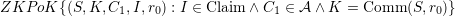
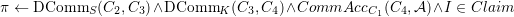
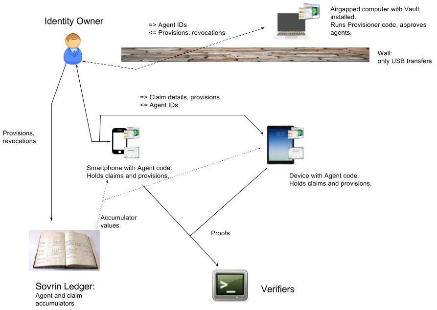

# Agent Authorization Policy

## Version 2

Each Identity Owner creates a Policy on the ledger, identified by an address **_I_**. Each agent has an agent policy keypair that will be used with **_I_**. The policy allows a key to have some combination of four authorizations:

* **0: PROVE**: agents with this authorization can create Proofs from Credentials

* **1: PROVE_GRANT**: agents with this authorization can grant the PROVE authorization to other agents

* **2: PROVE_REVOKE**: agents with this authorization can revoke the PROVE authorization from other agents

* **3: PROVE_ADMIN**: keys with this authorization can modify the provision or revoke prove authorization policy, i.e., grant and revoke the PROVE_GRANT authorization
    * PROVE_GRANT_GRANT
    * PROVE_GRANT_REVOKE

Each authorization is either on or off. Therefore, an array of authorizations can be represented in a bitmap using the well known position for each authorization. For example in big endian, 0001 represents [PROVE], and 1000 would represent [PROVE_ADMIN].

This is a public record, but no information in this public record is ever shared with any other party. Its purpose is to allow for key management of devices in a flexible way, while allowing for entities to prove in zero knowledge that they are using an agent that is authorized by the entity. This ZKP is possible because the ledger maintains a global accumulator for all keys with the PROVE authorization, called the Prover Registry. When a key is added to a Policy, and that key is given the PROVE authorization, the ledger adds a commitment to the Prover Registry. When a key loses its PROVE authorization, the ledger removes the associated commitment from the Prover Registry.

* A can revoke A, B, and C, and where B, can only revoke B and C

* This is a deep subtopic

### Setup

1. Trusted setup

    1.1. There is a global accumulator needed to store commitments to the keys with PROVE authorizations. 
    From this accumulator, a key can prove in zero knowledge that it is authorized to prove. This requires a trusted setup.

#### ID Owner's First Agent

1. Agent creates policy management keypair (Appk, Apsk) and a secret S

2. Agent creates policy address **_I_** on the ledger and adds Appk  as a key and ensures that key has all authorizations (111).

3. Agent adds K = Comm(S, r0) to the PROVE authorization.

    1. What kind of accumulator to use?

4. The ledger adds commitment Comm(K, **_I_**) to the global accumulator **_A_**. The only commitments added to the global accumulator are those values with the PROVE authorization.

#### ID Owner's Subsequent Agents

1. One authorized agent (or multiple agents in a multisig scenario) provisions a new agent. 

2. The new Agent creates policy management keypair (Appk, Apsk) and S. 

3. New agent sends Appk and K= Comm(S, r0) back to the provisioning agent(s).

4. Provisioning agent(s) adds authorization for Appk and K to the policy.

#### Lifecycle

 As agents are granted PROVE authorization in address **_I_****_, _**the ledger adds or removes the commitments to the accumulator. Agents can be added to be provisioners and revokers by admin agents. The provision or revoke policy can be changed to require more than one agent to agree on a change like 2 of 3. The ledger will enforce these rules by requiring multiple signatures complete the transaction.

### Claim Lifecycle

#### Issuance

1. Claim Receiver sends a Claim Request, which contains a blinded link secret and blinded address **_I_**.

2. Issuer selects an index i for the claim from his non-revocation accumulator AI.

3. Issuer generates claim C using AI.

4. Issuer sends C and AI to Claim Receiver.

5. Issuer adds i to his non-revocation accumulator AI.

6. Claim Receiver provides C and AI to Identity Owner.

7. Identity Owner gives C, and AI to Proof Presenter. 

#### Proof Presentation

1. Claim Presenter refreshes the revocation data from the non-revocation accumulator and Prover Registry.

2. Claim Presenter requests access from a Verifier.

3. Verifier sends a Proof Request: what must be proven and which attributes must be disclosed.

4. Claim Presenter sends disclosed claim attributes and other proofs (in zero-knowledge) and a zero-knowledge proof that

    4.1. 

    4.2. 

    4.3. 

    4.4. 

    4.5. 

    4.6. 4.6.1.  is defined for prime 

    4.6.1.  is defined for prime 

    4.6.2. 

    4.6.3. We say that  for .

    4.6.4. It must hold that 

    4.7. 

    4.8. Our intention is to prove the hierarchy of commitments:  is a commitment to K, which is itself a commitment to S. We want to prove the knowledge of S by putting it in another commitment .

    4.9. All values not enclosed in ()’s are assumed to be known to the verifier. 

    4.10. We want to prove  

    4.11. For this we need additional commitments C2,C3,C4.

    4.12. 

    4.13. The proof can be prepared as concatenation of

        4.13.1. NIZK{ (r4,C1): (C1 in A) && C4 = Comm(C1,r4) } = CommAcc proof

        4.13.2. NIZK{ (K,I,r2): Credential(I) && C3 =Comm(K,I,r2) } = Claim+commitment proof

        4.13.3. NIZK{ (K,I,r2,r4): C3 = Comm(K,I,r2) && C4 = Comm(Comm(K,I),r4) }        = DComm proof

        4.13.4. NIZK{ (S,r0,r1,r2,I): C2 = Comm(S,r1) && C3 =  Comm(Comm(S,r0),I,r2)}  = DComm proof

    These 4 proofs can be united into a single one with some reduction in size.

    4.14. Claim index i has not been revoked yet.

5. Claim Presenter generates 

6. Claim Presenter computes

    6.1. 

    6.2. 

    6.3. 

    6.4. 

    6.5. 

7. Claim Presenter sends  to Verifier

8. Verifier validates the proof

    8.1. Computes  and 

    8.2. Verifies that 

"I am a valid claim presenter"<=

<="I am part of the claim policy"<=

<="My public key is part of the claim policy"<=

<="I know the private key of the public key of the claim policy"<=

<="I know a private key and a public key which are part of the policy that is part of the claim."<=

<="I know S which is private key of a public key which is part of the policy that is mentioned in the claim”<=

<="I know K and S s.t. K is a commitment to S, and K is part of the policy that is mentioned in the claim”<=

<="I know K and S s.t. K is a commitment to S, and K is part of policy I, and I is the policy in the claim”

<="I know K and S s.t. K is a commitment to S, and (K,I) belong to the key-policy accumulator in the claim, and I is the policy in the claim”<=

<="Here is C1 which is a commitment to K which is a commitment to S, s.t. (K,I) belong to the key-policy accumulator, and I is the policy in the claim”

### Potential attacks

1. Inspecting the ledger reveals all of the agents that are associated with an entity. Hence even if Appk is revealed for one agent, agent is correlated to the entity, all agents of that entity are correlated.

    1. The security is provided by the fact that Appk cannot be derived from or correlated to the proof.

2. An agency that is malicious or compromised (all storage is encrypted). Kinds of compromises:

    2. Agency router logs are leaked, but the router is still in control of agency.

    3. Adversary is able to get into Agency machines and eavesdrop on all events (server logs, read disk files, etc) but still not manipulate agency machines.

    4. Active attack (partial control): The adversary controls and is able to manipulate some part of the agency.   

3. It will become obvious to third parties how secure a given address (person or organization) is. Does this encourage an attacker?

4. Correlation by network inspection (source/destination IP address, inference of packet timing and size)

    5. An agency router can act as a privacy-enhancing proxy. 

        1. Reason 1, by going through a proxy, the recipient would see the proxy's IP address, not the sender's IP address. Because many are using the same proxy, this masks the sender somewhat.

        2. Reason 2, an attacker could correlate based on the timing of messages or the size of messages sent through a router. A Router could hold messages for a random period of time before forwarding, and add random number of bytes of garbage to a message to thwart these types of inference attacks. 

        3. Note: this could motivate an attack on a major agency for the purposes of eavesdropping.

    6. With this solution, isn't It now *more *imperative that we employ a mix network? Or did we have the same risk with correlation of IP addresses?

## Version 1

TO ADD: agents can be linkable within the same relationship (DID-DID), but not across relationships.

UPDATE: [Simplification](agent_authorization_policy.md#4.%20Simplification) with scheme

### 0. Introduction

This protocol supports:

* Unique Identity Owner;

* Multiple Indistinguishable Claim Receivers;

* Multiple Distinguishable Claim Presenters (Agents);

* Unique Updateable Agent Revoker;

* Unique Non-updateable Provisioner.

### 1. Table of assets and roles

<table>
  <tr>
    <td>Asset\Role</td>
    <td>Identity Owner</td>
    <td>Provisioner</td>
    <td>Claim Receiver</td>
    <td>Claim Presenter</td>
    <td>Claim Revoker</td>
    <td>Agent Revoker</td>
    <td>Verifier</td>
    <td>Claim Issuer</td>
  </tr>
  <tr>
    <td>Agent key aag</td>
    <td></td>
    <td></td>
    <td></td>
    <td>O</td>
    <td></td>
    <td></td>
    <td></td>
    <td></td>
  </tr>
  <tr>
    <td>Agent revocation key aar</td>
    <td></td>
    <td></td>
    <td></td>
    <td></td>
    <td></td>
    <td>O</td>
    <td></td>
    <td></td>
  </tr>
  <tr>
    <td>Agent ID Vag</td>
    <td></td>
    <td>KM</td>
    <td></td>
    <td>O</td>
    <td></td>
    <td>KM</td>
    <td></td>
    <td></td>
  </tr>
  <tr>
    <td>Agent Revoker ID Var</td>
    <td></td>
    <td>K</td>
    <td></td>
    <td></td>
    <td></td>
    <td>O</td>
    <td></td>
    <td></td>
  </tr>
  <tr>
    <td>Provisioning key apr</td>
    <td></td>
    <td>O</td>
    <td></td>
    <td></td>
    <td></td>
    <td></td>
    <td></td>
    <td></td>
  </tr>
  <tr>
    <td>Provisioning ID Vpr</td>
    <td></td>
    <td>O</td>
    <td>K</td>
    <td>K</td>
    <td></td>
    <td></td>
    <td></td>
    <td></td>
  </tr>
  <tr>
    <td>Agent certificate Sa</td>
    <td></td>
    <td>KM</td>
    <td></td>
    <td>O</td>
    <td></td>
    <td></td>
    <td></td>
    <td></td>
  </tr>
  <tr>
    <td>Link secret als</td>
    <td>O</td>
    <td></td>
    <td>K</td>
    <td>K</td>
    <td></td>
    <td></td>
    <td></td>
    <td></td>
  </tr>
  <tr>
    <td>Claim revocation key acr</td>
    <td></td>
    <td></td>
    <td></td>
    <td></td>
    <td>O</td>
    <td></td>
    <td></td>
    <td></td>
  </tr>
  <tr>
    <td>Claim revocation ID Vcr</td>
    <td></td>
    <td></td>
    <td>K</td>
    <td>K</td>
    <td>K</td>
    <td></td>
    <td></td>
    <td></td>
  </tr>
  <tr>
    <td>Owner defined attributes AO</td>
    <td>O</td>
    <td></td>
    <td>K</td>
    <td>K</td>
    <td></td>
    <td></td>
    <td>K</td>
    <td></td>
  </tr>
  <tr>
    <td>Issuer defined attributes AI</td>
    <td></td>
    <td></td>
    <td>K</td>
    <td>K</td>
    <td></td>
    <td></td>
    <td>K</td>
    <td>O</td>
  </tr>
</table>

#### Legend

O: owns

K: knows

KM: knows multiple values

### 2. Construction

* (aag, Vag) - private-public signature keypair, unique for agent.

* (aar,Var) - private-public signature keypair;

* (apr,Vpr) - private-public signature keypair;

* Sa = Siga_pr(Var,Vag)

* (acr,Vcr) - private-public signature keypair;

* Claim attributes signed by Issuer: Vpr,als, identity attributes

### 3. Use cases

#### 3.1. Setup

##### 3.1.1 Identity Owner

1. Identity Owner generates link secret als as a random value

2. Identity Owner defines owner-defined attributes AO;

3. Identity Owner selects an agent accumulator: his own one or a global one.

##### 3.1.2 Provisioner

1. Provisioner generates provisioning key apr;

2. Provisioner computes provisioning ID Vpr;

3. Provisioner tells Vpr to Identity Owner.

##### 3.1.3 Claim Receiver

1. Claim Receiver gets Vpr from Identity Owner.

##### 3.1.4 Agent Revoker

1. Agent Revoker generates agent revocation key aar and agent revocation ID Var.

2. Agent Revoker submits Var to Provisioner.

##### 3.1.5 Claim Presenter

1. Claim Presenter generates agent key aag and agent ID Vag.

2. Claim Presenter submits Vag to Provisioner.

3. Provisioner creates agent certificate Sa for Claim Presenter.

4. Provisioner adds Sa to the agent accumulator and sends Sa to Agent Revoker.

5. Claim Presenter stores Sa.

#### 3.2 Claim Lifecycle

##### 3.2.1 Issuance

8. Claim Receiver gets AO, als from Identity Owner;

9. Claim Receiver contacts the Issuer and submits AO, als, and Vpr in the blinded form.

10. Issuer selects an index i for the claim and adds it to AI.

11. Issuer generates claim C using AI.

12. Issuer sends C and AI to Claim Receiver.

13. Issues adds i to his non-revocation accumulator.

14. Claim Receiver provides C and AI to Identity Owner.

15. Identity Owner gives C, AO, als,AI, and Vpr to Claim Presenter.

##### 3.2.2 Presentation

9. Claim Presenter refreshes the revocation data from the non-revocation accumulator and agent accumulator.

10. Claim Presenter contacts Verifier.

11. Verifier provides a presentation policy: what attributes must be disclosed.

12. Claim Presenter presents claim attributes (in zero-knowledge) and a zero-knowledge proof that

    23. He knows Vpr contained in the claim;

    24. He knows (Var,Vag),Sa, where Sa is a signature of (Var,Vag) on Vpr;

    25. He knows private key corresponding to Vag;

    26. Vag has not been revoked yet.

    27. Claim index i has not been revoked yet.

13. Verifier checks the proof.

##### 3.2.3 Revocation

1. Issuer selects the index i to revoke.

2. Issuer removes i from the non-revocation accumulator

#### 3.3 Agent Revocation

1. Agent Revoker selects the agent he revokes and retrieves his agent ID Vag and certificate Sa.

2. Agent Revoker approaches the agent accumulator and provides Sa and a zero knowledge proof that

    1. Sa is a signature on some key on some (Var,Vag).

    2. He knows the private key from Var.

#### 3.4 Agent Revoker Rotation

1. Generate new Agent Revoker ID.

2. Issue new agent certificates using the new Agent Revoker ID.

3. Replace the old agent certificates with the old ones.

4. Revoke the old agent certificates/

### 4. Simplification

The process can be simplified if we assume that the Identity Owner has a software/hardware vault, where he keeps all most valuable secrets and runs protected code. Then the Provisioner code may run there, and needs only occasional interaction with the outer world to publish his ID, provision new agents, and revoke them.

