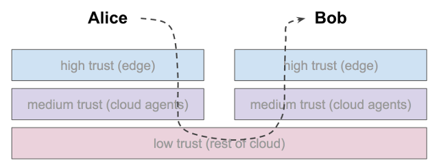
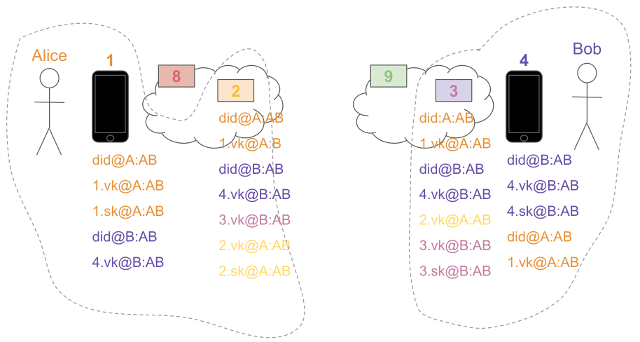

# Love Letters

Let us use a familiar circumstance as a case study in secure communication.
Suppose Alice and Bob wish to carry on a private romantic conversation.
We will explore how this interaction unfolds across the edge and cloud
agents owned by Alice and Bob, and how it also involves services in the
low-trust layer of the ecosystem.

The general flow will be as follows:

As we have mentioned elsewhere, people can't speak in bytes, or hear them.
They need agents to do that. These agents need to be authorized, which
means they need cryptographic keys. And keys means there must be a secure
way to store secrets, which implies wallets.

## Initial State

The state of agents, keys, wallets, and service that provide the backdrop
for this interaction looks like this:

Here, agents are numbered. Alice has two agents under her control: 1 (on
a mobile phone, in the high trust layer) and 2 (in the cloud, in the
medium trust layer). Bob also has two agents under his
control: 3 (in the cloud) and 4 (on his mobile phone). A dotted line has
been drawn around the _sovereign domains_ controlled by Alice and Bob.

Not all of these agents are strictly necessary; Alice could use 1 and
Bob could use 4, without any other parties involved. However, cloud
agents add certain convenience (e.g., a stable, permanent http endpoint)
and are likely to play a role most of the time, so we've included them.

Some other agents are also shown -- 8 and 9. These agents are not
strictly necessary, either, but again, we include them for illustrative
purposes. These would be agents at the _agencies_ that host Alice and
Bob's cloud agents, respectively. Such agents can provide helpful
services for many customers. They are part of the low trust layer, as
far as Alice and Bob are concerned.

The cryptographic material in the _identity wallets_ of each of these
agents is listed under the respective number. For example, Alice's edge
agent, 1, has a DID+public verkey+private signing key triple, identified
by did@A:AB (the did for Alice [A] in the Alice~Bob [AB] relationship);
1.vk@A:AB (the verkey belonging to 1 on Alice's side of the AB
relationship); and 1.sk@A:AB (the signing key belonging to 1 on Alice's
side of the AB relationship). Hopefully the notation is intuitive enough
that you can guess what other pieces of data mean.

Notice that signing keys only appear in a single place -- 1.sk@A:AB
appears only in 1's wallet; 2.sk@A:AB appears only in 2's wallet; 3's
signing key appears only in 3's wallet; and 4's only in 4's wallet.
However, the public verkey for these entities appears in multiple places.
This is as we would expect; many parties know another party's verkey,
but only one party knows the signing key.

Notice, also, that Alice and Bob themselves do not hold any keys. This
may feel a bit surprising--but remember, people can't deal with bytes.
That's the job of software agents. (Technically, it is possible for Alice
and Bob to hold keys on pieces of paper, but those keys are inert until
they are given to a piece of software, so we ignore that case when we
say "only agents can hold keys."

## Sending a message

Now, suppose Alice wants to send a message to Bob. On her mobile phone,
she types/texts the original message, "Sweet nothings." We will call
this message _m0_. Her agent, 1, then applies a series of
transformations to her message, controlling how it is encrypted and routed.
The message starts in Alice's high trust layer, passes through her medium
trust layer, is routed through low trust services, and eventually appears in
Bob's high trust context again. We will describe these steps in excruciating
detail, but like TLS in an http world, this all happens magically as far
as Alice and Bob are concerned; to them, it feels like just pressing
*Send* and responding to a notification that
a message has arrived.

### Step 1

Alice wants only Bob to be able to read _m0_. Since Bob reads
messages on his phone, Alice needs to encrypt for Bob's edge agent, 4. She
wants Bob to know who sent this message, so she calls `auth_crypt(`
_m0_`, 4.vk@B:AB, 1.vk@A:AB)`. This transformation
of her message requires the public verification key of the recipient,
plus her private signing key. (In the implementation of this protocol in
indy-sdk, Alice passes two verkeys instead. This is because the signing
key 1.sk@A:AB is known only to her wallet, and is never accessible to the
application layer; it uses the verkey to tell the wallet to look up the
signing key...) This produces a new message, _m1_,
that 4 can decrypt. 4 knows it came from 1, because 1's verkey is
communicated in the packaging in a way that only 4 can read. (For those
interested in hard-core details, the packaging uses libsodium's
Public Key Authenticated Encryption plus libsodium's Sealed Box primitive.)

### Step 2

Now Alice has a problem: how will she get the message to Bob? Bob's edge
agent 4 doesn't have a static IP address, which is a wrinkle. Further,
Alice's own phone is running out of battery. What she'd like to do is
send the message to her own cloud agent, 2, before her battery dies, and give
2 instructions to get the message to 4.

Alice's agent 1 packages the message for this routing instruction by calling:
`forward(`_m1_, `did@B:AB)`. This transformation produces a
new message, _m2_, that could be processed correctly by her
cloud agent, 2.

### Step 3

But who should be able to read _m2_? Only 2, of course. Between
Alice's phone and her cloud agent, there may be much untrusted networking
infrastructure. So Alice's agent 1 now encrypts again:
`auth_crypt(`_m2_`, 2.vk@A:AB, 1.vk@B:AB)`. This produces _m3_.

### Step 4

How is 2 going to get _m3_?

There are many possible answers to this question, but for the current
discussion we will assume that 2 is running at an agency, and that the
agency provides a low-trust message routing service as part of its own
agent, 8. This service is similar to a _mail tranfer agent_ in the world
of SMTP; it maintains an inbox and mindlessly delivers messages according
to the address label in the message packaging.

Alice's agent 1 now transforms _m3_ into _m4_ by calling:
`forward(`_m3_`, did@A:AB). If she gives this message to
8, it will know to route it to Alice's agent 2 because it knows that 2
services did@A:AB.

### Step 5

Anybody might snoop on _m4_ while it's in transit between
Alice's phone and 8. Therefore, Alice's agent 1 does one final transformation:
`anon_crypt(`_m4_', 8.vk). This creates _m5_. It does not tell 8 who is asking
to send a message, but it prevents evesdropping.

### Step 6

With all this packaging done, Alice's phone can now send _m5_
to 8 over any type of insecure channel. When it arrives, 8 calls
`anon_decrypt(`_m5_`)`, and is now looking at _m4_,
which is a plaintext instruction to forward a payload, _m3_, to the agent that
services did@A:AB. 8 looks up this agent and decides that 2 is the proper
recipient, so it forwards _m3_ as requested. It has no idea
what it is forwarding, or who it came from. (You may be wondering about
spam. Spam is not prevented at this layer, but rather at 2, which is
in the medium trust layer. It has policies that govern what to accept
and reject.)

### Step 7

When 2 receives _m3_, it decrypts, noting that the sender
is Alice's agent 1, which it knows to be authorized to act for Alice.
The decryption produces _m2_, which is an instruction to
forward an encrypted payload, _m1_, to the DID by which Bob
is known to Alice.

### Step 8

Alice's cloud agent, 2, now performs a process very similar to the one
that her edge agent, 1, went through. It can't read Alice's plaintext
message, but it knows that Alice wants an encrypted payload delivered to
Bob.

It looks up the permanent endpoint for Bob on the ledger; the URL
that's returned is the URL of 9 (the mail routing service for Bob at
Bob's agency). Just as 1 built something for 2 via 8, 2 must build something
for 3 via 9.

2 begins by calling `auth_crypt(`_m1_`, 3.vk@B:AB, 2.vk@A:AB)`.
This ensures that 3, upon receiving the message, will know it came from 2.
The new message is _m6_.

### Step 9

Now 2 has to account for the routing instruction that 9 needs to see,
to deliver _m6_ to Bob's cloud agent 3. She calls
`forward(`_m6_`, did@B:AB)`. This produces _m7_.

### Step 10

Between 2 and 9, an evesdropper could lurk. 2 wants to guarantee that such
parties can do no harm, so 2 calls `anon_crypt(`_m7_`, 9.vk)`,
producing _m8_.

### Step 11

2 is now ready to send. It contacts 9 and drops the encrypted payload
_m8_. When 9 sees it, 9 calls
`anon_decrypt(`_m8_`)`, and is now looking at _m7_,
which is a plaintext instruction to forward a payload, _m6_,
to the agent that services did@B:AB. 9 looks up this agent and decides
that 3 is the proper recipient, so it forwards _m6_ as requested.
It has no idea what it is forwarding, or who it came from.

### Step 12

When 3 receives _m6_, it decrypts. This produces _m1_,
an encrypted message that 3 cannot read. However, 3 knows that this
encrypted payload is intended to be read by Bob (since 3's only purpose
in life is to help people communicate with Bob). Thus, 3 concludes that
it must forward the message to 4. The message is already encrypted for 4,
so 3 simply sends it over any convenient method (e.g., mobile push notification).
And Bob gets Alice's message.

## Variations

Many of the steps that we described above have alternate paths that are
equally valid. For example:

* Alice's agent 1 could have contacted Bob's agent 3 via 9, without ever
  using 2 or 8. This would simplify the workflow a fair amount, and would
  have the additional privacy advantage of not allowing Alice's cloud agent
  to be aware of some of the communication she's doing. It is a valid
  choice in Janus. However, such a choice would
  make it hard for Alice to give special delivery instructions that
  enhance convenience or privacy, such
  as "Deliver this next week, when I'm gone backpacking in the Himalayas
  and don't have an internet connection" or "Route this message through
  a mix network so 9 cannot tell the originating IP address" or "Retry
  message delivery for up to 6 weeks"

* Alice's agent 1 could have done all of the wrapping, not just the first
  part that got the message to 2. This style of packaging is called "onion
  packaging", since it adds many layers, whereas the style we described
  above is called "JIT (just in time) packaging", since it only does one
  leg of the route at a time. Both styles have pros and cons, and both
  are supported by Janus. Onion packaging is more opaque to intermediate
  participants, but also more fragile.

* Alice's agent 1 could have contacted Bob's agent 4 directly, if 1 and
  4 were connected over bluetooth or some other channel that allowed a
  short circuit. This, too, is supported by Janus.

* Alice could have chosen to use greater privacy by calling `anon_crypt()`
  instead of `auth_crypt()` in steps 3 and/or 8. This choices would have
  made it impossible for one or both of the cloud agents to recognize
  the sender. Janus supports such usage patterns, but either cloud agent
  could be configured with a policy that drops messages from anonymous
  senders, if Alice and Bob make that choice.

