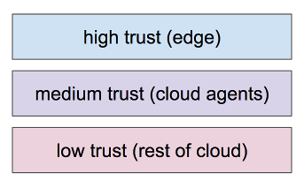

# A Layered Ecosystem

As mentioned in the Janus overview, communication unfolds against a
landscape that is complex. Participants include individual human identity
owners, institutions, and IoT things. These participants may be proxied
by one or more software- or hardware-based agents. Technologies may be
cloud-based or edge-oriented.

There are many possible ways to describe this picture; each focuses on
some realities but suppresses others as being less relevant to insight.

Janus chooses to think in terms of layers of trust:



## Layers of trust

The high trust layer is where legal accountability lives. Interactions
in this layer typically require human approval. They take place on
_edge devices_ such as mobile phones, laptops, and on-prem servers
belonging to an enterprise.

The medium trust layer is embodied in devices and services that are not
under the direct control of their associated identity owners, but that
still carry out explicit instructions from those owners. These components
are still _owned_ in an important sense by a single participant from the
high trust layer, and have a fiduciary responsibility to proxy faithfully.

The low-trust layer consists of services and devices that provide mass
services. These components may be highly trustworthy, but they contribute
value without needing to represent and proxy in the same way.

## Problem sets
1. Enduser problems
1. How to implement smart policy that adds value
1. SPAM

## Objectives
1. Support highly-trusted Edge Agents
1. Support semi-trusted Cloud Agents
1. Support low-trust Cloud Services (like an Agency Router)
1. Agents need to be able to act on my behalf according to some authorization or policy


# Messaging Layers (Daniel & Devin)
1. Comms or Routing Layer
1. Agent Layer
    1. threads of interactions
1. 
    
# Orthogonal principles
1. Edge, Cloud, Untrusted & 
1. Packaging layers


# Example Scenario
Alice sends message to Bob

# Example Structure
```json
{
  "route_msg": sealed_box({
    
  })
  "cloud_msg": {...},
  "edge_msg": {
    "header": {
      "type": "CRED",
      "type_version": "0.1"
    },
    "payload": {<some credential>}
}
```

```json
}
```


# Packaging
1. The message itself
1. Add header (and possibly sig) for message
1. Interaction context
1. Routing: where you want to send something


# Future optimization
1. Encrypting information so that agents can see a subset, and the enduser can see all, without redundancy.

