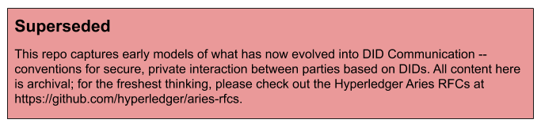

# Ledger
The Ledger acts as a public, tamper evident data structure that is capable of storing and maintaining objects that support signing and authenticating, issuing and revoking, and proving and verifying peer-to-peer interactions.

## What's on the Ledger?
The protocol stores the following Public Objects on the ledger:  
*Note:  The public objects on the ledger are created/updated through events called transactions. Each transaction has 2 sections, a payload section called `data` and a meta section called `reqMetadata` that will contain metadata like the author of transaction, nonce for the transaction, etc.*
1. Public DIDs and DID Documents (including public keys and addressable endpoints)
1. Schema (supports public understanding of the organization and semantics of credentials and messages)
1. Credential Definitions (references a Schema and includes public keys created by the Issuer for that type of Credential)
1. Revocation Registries (supports proving a credential is still valid, references a Credential Definition)
1. Agent Authorization Policies (supports proving an agent is authorized to create proofs from certain credentials)
1. Anchors (supports proof of existence for objects or state of other ledgers, private or public)

## What's not on the Ledger?
1. Private keys, symmetric keys,
1. Personally identifiable information (PII), including hashes of PII
1. Credentials
1. Proofs
1. Authentication or Verification transactions
1. Application specific messages

### Requirements
Generating a new Credential does not require writing to the ledger if the Issuer pre-issues the Revocation Registry. Authentication does not require a write to the ledger either; it requires a read though. 

Proving a Credential is not revoked, and verification of a Proof both require reading from the ledger. Therefore the ledger should have good read performance.
