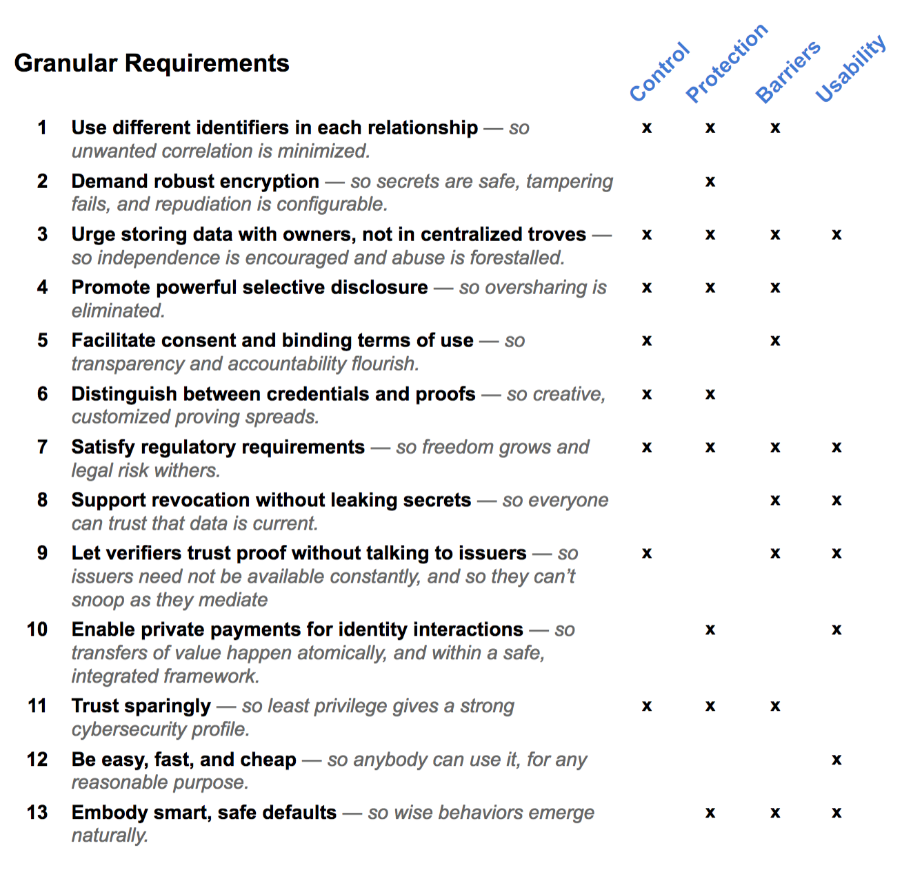

# Self-Sovereign Privacy By Design 

Why it Matters, What it Entails, and How it Thrives

Daniel Hardman, Jason Law

March 2018

*(this long treatise has a sister document that provides a short, high-level summary; see [Self-Sovereign Privacy By Design, Distilled](sovereign_privacy_by_design_distilled.md)).* 

## The Stakes for Digital Privacy

Physical credentials often leak information. A bar needs to know that we’re over the legal drinking age; we offer a driver’s license as proof, and the bouncer may see extra info in the process. Privacy erodes.

This erosion has some risk—a college student might be uneasy about a bouncer seeing her home address, height, weight, and birthdate—but in practice, the risk is often tolerable. We don’t expect the bouncer to remember what is scanned in a casual glance, and we assume he has neither the means nor the motive to collude with other places we frequent. The physical world constrains what’s practical.

Digital credentials transform this risk. Computers, not people, read digital credentials—and they have perfect eyesight, superb attention, and unlimited memories. They are pervasively connected and chatty. Plus, they inhabit an ecosystem where "the customer is the product", (NOTE:  Solon, Wired, Sep 2011. http://bit.ly/2j6omey § Kepes, Forbes, Dec 2013. http://bit.ly/2zms7AO.) fortunes follow predictive analytics, (NOTE:  Markets And Markets, Aug 2017. http://bit.ly/2yByq6f.) drones are ubiquitous, (NOTE:  Bliss, CityLab, Aug 2014. http://bit.ly/2haykaL.) governments demand access to user data, (NOTE:  Farivar, Ars Technica, Nov 2017. http://bit.ly/2i5qcZR § Phys.org, Oct 2017. http://bit.ly/2yCkCZv § Cheshire, SkyNews, Sep 2017. http://bit.ly/2zB6Hmj § Chirgwin, The Register, Jul 2017. http://bit.ly/2zAOntN.) hackers penetrate one target after another, fraudsters buy bulk personally identifiable information (PII) on the dark web, (NOTE:  CSID (Experian), Apr 2017. http://bit.ly/2zCyoLR § Francis, CSO Online, Apr 2017. http://bit.ly/2AqpGgK.) regimes treat dissidence as a capital crime, vulnerable populations beg for help, and oppressors and hate groups use our profiles to target us for violence or disinformation. (NOTE:  Schneier, 2016, Data and Goliath. ISBN-13: 978-0393352177 § Hill, Gizmodo, Oct 2017. http://bit.ly/2j8qMcD § Hill, Gizmodo, Aug 2017. http://bit.ly/2lVBbtg § Hill, Splinter News, Aug 2016. http://bit.ly/2izI9iT § Wu, Knight First Amendment Institute, Sep 2017. http://bit.ly/2y9fFD1. Sydell, All Tech Considered, Oct 2017. http://n.pr/2haaj3I
)

In such a world, both means and motives to abuse leaked information abound—and abuse ensues, as headlines demonstrate *ad nauseum*.

Some imagine even darker days ahead:

[T]he danger is that the blockchain could become the infrastructure for a regime of control unprecedented in human history. There is no reason, in principle, why individuals could not become objects in a giant supply chain, tracked like commodities as they move and transact around the world. Participating in this tracking could become the precondition for access to all forms of tokenized resources—including government currencies, utilities, financial services, the ability to make purchases within certain jurisdictions, and basic rights and privileges. (NOTE:  Smolenski, "Owned vs. Unowned Claims and Self-Sovereign Identity", Rebooting Web of Trust, Oct 2017. http://bit.ly/2m02r9U.)

The stakes for digital privacy (NOTE:  Here, we are defining privacy to include all four dimensions of privacy identified by Christopher Allen in his 2015 taxonomy. See http://bit.ly/2AeUMqz.) are high indeed.

image credit: pixabay.com (CC0)

## Practical Doubts

Some shrug. "Privacy’s a pipedream," they say; “the battle’s already lost.” Or “People will gladly trade privacy for convenience. We do it all the time.” Or “It’s just not practical to build a system where privacy guarantees are strong enough.”

This logic is a pessimistic, self-fulfilling prophecy—exactly what George Bernard Shaw had in mind when he quipped, "The reasonable man adapts himself to the world; the unreasonable one persists in trying to adapt the world to himself. Therefore all progress depends on the unreasonable man." (NOTE:  Shaw, Maxims for Revolutionists, 1903, #124.) Tech innovation might create the possibility for new behaviors, new legal protocols, and new social constructs that stem the tide of surveillance—but we’ll never know, if we don’t try. Shrugging also ignores the fact that in a generation or two, the digital landscape will be populated by people who’ve not yet lost a single datum of their privacy. The battle is ours to lose for them, if not for us.

Dismissal isn’t the only surrender here. Perhaps more dangerous is to champion a false privacy that’s easy to build and sell to a credulous public, but that is unacceptably dangerous underneath. When approaches to privacy rest on voluntary good citizenship from the very institutions that gut privacy today, they’re offering false privacy—not the real deal. When they offer selective disclosure or revocation that leaks needlessly, they’re offering false privacy. When they encourage correlating identifiers or require that issuers know every time their claims are used, they’re offering false privacy. Such approaches may address a few use cases and dull the privacy pain for a while, but they only mask symptoms of an unhealthy ecosystem.

Of course, there are practical concerns that must be wrestled. Quick kludges will look attractive compared to deep solutions. But if we care about self-sovereign identity, we must confront this fundamental truth:

*Sovereignty over an identity must include meaningful control over how data about that identity propagates. Thus, any approach to identity that cannot offer strong privacy also cannot be self-sovereign, because it cedes control to whoever captures leaked secrets.*

This truth is clearly implied in "A Primer on Self-Sovereign Identity", (NOTE:  Allen and Applecline. Rebooting Web of Trust, Oct 2017. http://bit.ly/2qf8ycB.) where one of the asserted pillars of self-sovereignty is *control*:

Users must control their identities. Subject to well-understood and secure algorithms that ensure the continued validity of an identity and its claims, the user is the ultimate authority on their identity. They should always be able to refer to it, update it, or even hide it. They must be able to choose celebrity or privacy as they prefer.* *

Sovereignty depends on control and control depends on privacy. 

To be clear, we embrace the assertion that celebrity is just as valid a choice as privacy. It is the *choosability* of robust privacy, not its mandate, that we’re advocating. But the ability to choose must be rich and friendly and easy—it can’t just be theoretical. It must be the default mode of operation, not an opt-in that people activate occasionally, because correlation is a contagion that spreads unless it’s actively fought. (We endorse the ethos and thinking behind privacy by design, and in particular the privacy implications of Kim Cameron’s Laws of Identity. (NOTE:  Cameron, Identity Blog, May 2005. http://bit.ly/2znbLId.))

We also embrace the hedges in the two indented sections above, where control is assumed to come with reasonable limits. This is simple reality. A self-sovereign identity owner can’t demand absolute, unconditional control over anything that touches their domain, any more than a queen can demand darkness in a neighboring kingdom just because rays of sunlight pass through "her" air on its way across the border. Privacy does not demand that people who’ve seen you walking down the street forget the event happened—only that they mind their own business.

But caveats and concerns do not diminish this core truth: *Strong, true privacy—we might say ***_self-sovereign privacy_***, since it requires empowerment within one’s domain—is a bedrock requirement for self-sovereign identity. We have to nail it.*

## Guiding Principles

We claim that any identity mechanism aiming to support sovereign privacy by design must vigorously pursue these four ideals: (NOTE:  See also Cavoukian, Privacy by Design: 7 Foundational Principles. Jan 2011. http://bit.ly/2zb3i9X.)

**_Control_** for identity owners

**_Protection_** of secrets

**_Barriers_** against abuse

**_Usability_** for all

## Granular Requirements

These guiding principles are deep and demanding. They imply use cases (NOTE:  See "Potential Use Cases for SSI and Self-Sovereign Privacy". http://bit.ly/2pNnJX3.) with specific requirements:

## #1: Use Different Identifiers in Each Relationship (← *control*, *protection*, *barriers*)

Correlation drives privacy problems. We want to have interaction A, and we want to have interaction B, and within the context of those interactions, we will disclose certain information to facilitate. What we don’t want is to have the information from A and the information from B mingle in a way that violates our intent. Bob wants to be an employee of Acme, and he wants to elect the Flat Earth Society candidate as President; he doesn’t want his employer to correlate him to his politics, or his political party to call him at the office.

### What Can Correlate?

Correlation needs shared data points. Sometimes these correlators are obvious—a phone number, an email address, a social security number, an identifier. But any byte sequence that is adequately unique and common across contexts has the same effect. This includes public keys, hashes, digital signatures, URLs, and other common underpinnings of the modern web. If Alice uses the same instance of any of these values in more than one relationship, correlation becomes trivial. This is a serious design flaw in some privacy approaches we’ve seen. If, on the other hand, Alice is known by different public keys, hashes, digital signatures, URLs, and the like—in every relationship she has—then the other parties in these relationships have no easy path to correlation.

### A Practical Example

Consider how this plays out in a law enforcement scenario. Assume that Alice attracts interest from the police, though they don’t know her name at first. Each weekday, she parks her car in the Hudson Car Garage at 8:35 +/- five minutes, using an app to pay for the parking space. Then she crosses the street to Starbucks to buy a pumpkin spice latte with Apple Pay. The barista greets her by name. About this time, she usually texts her mother as well. Alice’s identity with respect to these relationships can be correlated via her Apple account—not to mention via texting logs and stinger towers and surveillance cameras and credit card receipts and interviews with the barista.

What happens if, instead, Alice minimizes correlatable identifiers? If she buys with cash, there is no Apple ID to correlate across purchases. If she uses a burner phone from a random carrier, the cell number’s logs become useless. If she dons disguises, surveillance camera correlation becomes harder. If she buys a different cup of coffee each morning, and varies her arrival time within a two-hour range, and doesn’t give the barista her name, the problem is harder still.

None of this makes correlation impossible; Alice is still using a pattern that can be teased out with luck and careful observation. But Alice can raise the difficulty level by several orders of magnitude. *The fact that spycraft and criminal wisdom recommend exactly these types of correlation-defeating measures* (NOTE:  Wallace and Melton, Spycraft: The Secret History of the CIA's Spytechs, from Communism to al-Qaeda. ISBN-13: 978-0525949800 § Peters, Slate, June 2013. http://slate.me/2hbfVL5.)*—and that law enforcement agencies around the world do their best to discourage their use by private citizens—is a strong indicator that they are effective enough to matter deeply.*

### Too Late?

Some who are doubtful of a high bar for privacy take the position that sooner or later, enough data leakage will happen that there’s no point in bothering; the surveillance state and/or the surveillance economy will eventually know all. They point out that if two institutions come to know Alice’s name, age, and zip code (values deliberately and selectively disclosed by Alice), they can often correlate this fuzzy attribute cluster no matter how Alice minimizes disclosing other attributes, and regardless of whether both possess a strong correlator like an email address.

This argument is misleading. Correlation in some contexts is not the same as correlation in all contexts, or correlation that is known to all parties--and we can limit leakage in meaningful ways. Banks and governments both need PII for key interactions, and they can correlate to prove that a particular citizen holds a particular bank account. But that does not mean that banks and governments must necessarily be able to connect us to grocery purchases or attendance at a rock concert, Even some of our bank and government interactions can be done pseudonymously--qualifying for a loan, or using an electric car charger that a city offers to residents. By only giving PII in interactions that require them, and by firewalling non-PII relationships with different identifiers, whole dimensions of our behavior can be shielded from nearly all observers. (NOTE:  For more on this, see http://bit.ly/2mkr3Y8.)

This argument also ignores complementary requirements such as #5 (consent) and #7 (regulatory compliance). If data in Alice’s account with company A was disclosed to A with Alice’s consent, but under a "no sharing" proviso, the cross-company collusion becomes illegal. Even without this proviso, if aggressive use of selective disclosure (#4) demonstrates that the user’s intent was to restrict usage to just her direct interaction, the legal justification for correlating is shaky at best. (And minimal disclosure should be the default choice thanks to requirement #13). GDPR and like-minded regulations create strong disincentives to flout this ethos. Consider record fines against the banking industry for mismanaging customer PII and consent (NOTE:  Fortune, Jul 2017. http://for.tn/2haKIYp § Merie, Washington Post, Aug 2017. http://wapo.st/2yaV0P4 § Treanor, The Guardian, Dec 2016. http://bit.ly/2h96RGj § Neate, The Guardian, Feb 2016. http://bit.ly/2j5q3sY. Treanor and Rushe, The Guardian, Dec 2012. http://bit.ly/2zBqkL7.). Equifax’s recent meltdown (NOTE:  White, The Atlantic, Sep 2017. http://theatln.tc/2zCorho.) is the latest example of a debacle that will reinforce the trend.

### Assume the Status Quo?

The "we can’t win anyway" argument also assumes no evolution in the ecosystem’s behavior patterns when a sovereign privacy solution takes hold. Again, this is unwarranted.

Today, institutions store data in centralized troves, and they consider that data authoritative. This is because the data is hard to acquire and verify, and users can’t provide it in formats that are easy for institutions to consume. But *imagine a world where the right solution to sovereign privacy is commonplace*—each relationship composing an identity is firewalled from the others for everybody except the owner—and institutions have truly internalized the benefits this provides. Instead of storing a customer address or phone number or credit card number in their database, they can contact the customer on a secure channel whenever they need the data—and receive an answer of provably high quality. Their chief information security officer can stop conducting security audits and worrying about hackers, since the company trove is minimized. They no longer need to take extraordinary measures to comply with privacy regulations. Their legal department shrugs when served with a subpoena, since their database discloses nothing that will worry their customers. They can eliminate change-of-password support from their website and call center. If they want deep intelligence about customers, it may still be available—but instead of buying it from shadowy brokers, they buy it directly from the customers themselves, or from reputable aggregators who pay customers fairly for a deliberate privacy-diminishing choice. Would surveillance still reign supreme in such a world?

Sovereign privacy won’t just stimulate changes in the thinking of political and business institutions; individuals who gain confidence in privacy and trustable peers will innovate in ways we don’t imagine today. Today, a friend who believes you might be recording her conversations will withdraw; a kid who feels vulnerable in a dark parking lot might react to a stranger by avoiding eye contact, folding his arms nervously, and walking briskly in a wide arc to avoid interaction. We’re conditioned to the digital equivalent of these reactions. But with better privacy, will we be more chatty? More willing to experiment with a service? More willing to escrow or put up a bond, instead of depending on curated reputation to commit?

Relationship-specific identifiers at least improve privacy in a direct and immediate way, by taking all the easy correlation off the table. But their benefits run deeper. They give users choice and meaningful freedom. They reinforce, and are reinforced by, other privacy measures. In the long run, they also alter incentives in the ecosystem to foster healthy innovation. And unless we implement them, privacy will remain fatally compromised no matter what else we do. They are therefore a must for sovereign privacy.

## #2: Demand Robust Encryption (← *protection*)

We assume this requirement is uncontroversial. However, it’s important to note that it’s insufficient to guarantee privacy, by itself. If a party receives encrypted data but then discloses it, privacy suffers. If we encrypt with the same key in many relationships, the utility of encryption is compromised by potential key loss or key sharing.

## #3: Urge Storing Data with Owners, Not in Centralized Troves (← *control*, *protection*, *barriers*, *usability*)

Some visions of privacy buy the notion that centralized institutions can be trusted as custodians of identity owner data. They imagine such institutions holding keys, secrets, and PII for users, and being trustworthy because they have good intentions.

History shows that this is a bad idea. Even great institutions can have rogue sysadmins, can be hacked, can be subpoenaed, can have a regime change, or can change their terms of service for various reasons. Privacy is best protected by removing temptation, preventing troves in the first place, and simplifying.

It will always be necessary to centralize some types of data. For example, a state that issues birth certificates will need to know what they’ve claimed on their credentials. But such data can be minimized, can be limited to internal use, can be unlinked from other systems, can be stripped of unnecessary secrets. Any secrets that need to be known only to an identity owner should be kept there, not elsewhere.

## #4: Promote Powerful Selective Disclosure (← *control*, *protection*, *barriers*)

When an identity attribute is disclosed, the disclosure must not leak anything extra. Some proposals for disclosure depend on credential IDs, digital signatures, or revocation lists that create strong correlators; this undermines most of the supposed benefits.

Selective disclosure means more than limiting disclosure to required attributes; it can mean disclosing only *portions* of an attribute, or disclosing only *predicates* about an attribute. For example, imagine Alice using the birthdate from a driver’s license to prove she is over the age of 18. Disclosing the full birthdate value satisfies this proof criterion, but it’s overkill, and it can be strongly identifying. Better would be to share just her birth year, which would work for most people. If Alice turned 18 this year, then she'd have to fall back to showing birth year and month. A safer alternative might be to ask an issuer to attest an attribute "over 18" in the credential they give; then Alice can prove she’s over 18 without sharing anything except a boolean.

But what if Alice now has to prove she’s over 19, or over 21? The ability to prove predicates such as "greater than" or “less than” approaches the sort of flexibility and power she needs. This capability fully achieves its promise when it’s coupled with the sort of zero-knowledge proof mechanisms provided by technologies such as ABC4Trust (idemix) (NOTE:  See https://abc4trust.eu/.) and uProve. (NOTE:  See https://www.microsoft.com/en-us/research/project/u-prove/.)

## #5: Facilitate Consent and Binding Terms of Use (← *control*, *barriers)*

Most identity interactions with physical credentials create no written record, and give no opportunity to negotiate and record terms and conditions in the process. Unfortunately, some mental models for digital proof have adopted similar assumptions, which creates a power imbalance between identity owner and verifier.

In digital interactions, software can negotiate terms and record what they were, as an indivisible part of how proof is shared: "I will let you see my birthdate, if you agree by binding digital signature that you will use that data only to provide services to me--never to resell it or share it with external parties." This protects both sides—and as noted above, it makes some other requirements of sovereign privacy more valuable.

## #6: Distinguish Between Credentials and Proofs (← *control*, *protection*)

A verifiable credential (or, in some idiolects, a *claim*) is a digital document that an issuer creates to describe identity attributes. Credentials are important and valuable—but they must not be equated with proof.

The first reason is simple: if the same credential (or same doc hash, or same credential ID, or same unique signature on the doc) is presented as proof in multiple contexts, it becomes a correlator. Sovereign privacy requires a unique, context-specific proof to be generated from a claim each time it’s presented. The proof must draw upon material in the credential, and must reference digital signatures of the issuer to demonstrate authenticity and tamper safety—but it cannot disclose any uniquenesses of the owner’s identity (other than deliberately disclosed attributes), of the owner’s relationship to the issuer, or of the credential itself.

A second reason to separate these concepts is that dynamic proving enables predicates, required for selective disclosure. Issuers no longer have to anticipate every way their credential can be used; new and creative usages can emerge. This decreases the burden on issuers (the *usability* principle), and increases the options of users (the *control* principle).

A third reason to distinguish these concepts is that proofs may require combinations of information from multiple credentials. In a loan application at a bank, for example, portions of the submitted data may derive from tax credentials, credentials of a job from an employer, credentials of credit worthiness from a CRA, credentials of residency from a driver’s license, and so forth. If these credentials are simply presented one at a time, in serial, some attribute(s) common to the credentials must be disclosed to prove they belong to the same owner. That’s correlation. A proof, on the other hand, can provide cryptographic evidence that all the source credentials were issued to the same person, without disclosing the names or values of the attributes they share. This is only possible if the proving operation spans multiple source credentials and therefore uses a different artifact from the credentials themselves.

## #7: Satisfy Regulatory Requirements (← *control*, *protection*, *barriers*, *usability*)

An acceptable approach to privacy needs to adapt itself to the requirements of various legal jurisdictions. It must enable GDPR- and HIPAA-style requirements about right to be forgotten, right to audit, and right to dispute. Many of these requirements are easier if we also address requirement #3 (prefer storing data with the owner) and #4 (binding consent).

## #8: Support Revocation Without Leaking Secrets (← *barriers*, *usability*)

Almost all credentials need a revocation strategy; even immutable ones like a birth certificate might need to be recalled if an error is detected.

Traditional revocation uses a revocation list, which is tied to some sort of credential ID. Credential IDs on a list require a check with the issuer, which violates requirement #9 (no issuer needs to participate in proving) and #6 (credentials vs. proofs). Revocation lists create correlation by testing revocation of the same credential in proof interactions that span contexts.

What we need, instead, is a way to prove non-revocation in the same message or document that contains the primary data for a proof. This mechanism needs to be easy for a verifier to check without contacting the issuer. It should also be easy for an issuer to update revocation status, without contacting the identity owner.

Cryptographic accumulators with a tails list offer a clever solution to this difficult requirement. (NOTE:  Khovratovich, "Anonymous Credentials With Revocation", Sep 2016. http://bit.ly/2ycbJ4E.)

## #9: Let Verifiers Trust Proof Without Talking to Issuers (← *control*, *barriers*, *usability*)

The act of proving based on credentials from issuer X should avoid requiring that issuer X be contacted, to the extent practical. There are logistical reasons why this is desirable (what if proving happens when issuer X is offline? Or after issuer X goes out of business?). However, the more important reason is correlation: if an issuer is consulted each time one of their credentials is used, they may be able to correlate the holder of that credential. Issuers should not know when one of their credentials is used. (Separating credentials from proofs makes this easier, since credentials are never seen by verifiers who want a proof.)

## #10: Enable Private Payments for Identity Interactions (← *protection*, *usability*)

Many transactions convey significant value because of the identity information at play. A student who applies to attend a university pays a processing fee so her identity and attributes can be reviewed; a medical researcher may purchase the medical profiles of a cohort; a vetting agency charges thousands of dollars for the research that confers a government security clearance. It’s highly desirable that transactions such as claim issuance or proof presentation offer the ability to transfer payment.

Of course, payment can be made with existing mechanisms—but nearly all digital payment solutions (credit cards, cryptocurrencies, etc) lack robust privacy, and many of them have such high fixed costs, or such slow performance, that they are impractical. Zcash satisfies the privacy criteria but is too slow to be useful in many cases.

## #11: Trust Sparingly (← *control*, *protection*, *barriers*)

Each actor needs its own keys. Private keys should never be shared. The most privileged keys must be kept next to the owners on devices they physically control—never disclosed to remote services. Backups must be managed in a way that doesn’t create back doors. Every actor must be authorized. Authorizations must be limited in time and scope to only what’s necessary, and must be adjustable as situations evolve. This embodies the principle of least privilege, which is an accepted best practice in cybersecurity.

## #12: Be Easy, Fast, and Cheap (← *usability*)

No solution to sovereign privacy will be adopted if it is seriously deficient in any of these dimensions. Each matters to all parties in the ecosystem, though they may prioritize them differently.

## #13: Embody Smart, Safe Defaults (← *usability*)

Naturally, behaviors in a sovereign privacy solution will be configurable. Different participants will select different tradeoffs. However, deep, specialized knowledge should not be necessary to be safe. Because of this, the postures that ensure strong sovereign privacy must be the default assumptions. In our requirements review above, we have noted cases where one choice reinforces or requires another; the sum of privacy-enhancing choices is greater than its parts, and being inconsistent about our posture degrades the gestalt significantly. Wise defaults thus help us guarantee that privacy is easy to achieve and hard to get wrong.

## Can’t We Be Less Ambitious?

Aside from the theoretical and practical misgivings that have been discussed above, there is another type of dissonance about sovereign privacy. It’s usually expressed like this: "The sort of system implied by these requirements depends on esoteric crypto that’s not ready for prime time. It’s unproven, and it’s extraordinary complex. It will take forever to build. We need a solution now. Maybe it’s smarter to be expedient and safe, tackle the parts of the problems with an obvious solution, and let tech mature. The market will tell us where we need to get fancy, later."

This is a seductive argument, because it satisfies a desire to pursue quick, short-term answers. Without evidence, it posits that these answers won’t be dead-ends. Our experience and intuition suggest otherwise; "peace in our time" didn’t work out so well for Chamberlain. But there’s a stronger rebuttal to such an argument: there’s no need to compromise if we already have all the pieces we need. Most mechanisms required to meet our requirements have already been implemented, and all have been described in academic research. 

## Call to Action

We call upon all friends of the self-sovereign identity movement to advocate for the robust, principled view of privacy articulated here. We believe that it is necessary for self-sovereignty, that it is achievable, and that if we deliver it, the digital landscape will be revolutionized in thrilling ways.

## Appendix: Research Notes

Thanks to Jan Camenisch for helpful material here.

*The below is still work in progress..* The basis of the algorithms that allow us to reach all the goals outlined have been laid by pioneer David Chaum. His work put forth the principles of anonymous credentials [chaum81], group signatures [chahey91], and electronic cash [chaum82]. The cryptographic research community has since developed and extended these ideas, put forth security models, and invented provably secure protocols. The first private credential system that is practical and yet provably secure was presented by Camenisch and Lysyanskaya [camlys01a]. That first scheme is based in the RSA assumption. A simplified version of it, called Direct Anonymous Attestation [BrCaCh04], was standardized by the Trusted Computing Group in 2004 [TPMV1.2]. Subsequently, schemes based on elliptic curve cryptography have been put forth and protocols providing an extended set of features were developed. All these schemes have been vetted by the cryptographic community over the last decade and come with security models and proofs. In the following we describe the basic ideas and give a short overview of the most prominent schemes in the literature.

 

The idea behind private credentials is similar to X509 attribute certificates with two essential conceptual differences. The first difference is that users no longer have a single secret key/public key pair but are enabled to derive *many different unlinkable* public keys from their (single) secret key. Users can choose to use a different public key with each of their communication partner or even for each transaction. An identity or attribute provider issues an attribute certificate or credential to a user by signing the attributes and the public key the user presented. The second difference to how X509 certificates are used is the way a credential is *presented* to a relying party. Instead of sending the certificate to a relying party, a user applies a zero-knowledge proof stating that she possesses a valid credential by the issuer. In theory, such a zero-knowledge proofs can be done even for ordinary X509 attribute certificate, how such a proof would not be efficient enough.

 

Say how these are solved.

 

Many certificates.

 

Attribute predicates

## Revocation. 

If an attribute of a user is subject to change, the credential vouching for that attribute might have to be revoked. There are essentially two approaches to address this requirement. The first one is to limit the validity of a credential and then second one is to publish information pertaining to the credentials that have been revoked (or, alternatively are still valid). Both approaches have their pros and cons and, depending on the specific application scenario, one might choose one or the other. When realizing each of the two approaches, care must be taken to properly address the privacy and security requirements.  A number of cryptographic solutions for both approaches exist that do address such requirements.

 

## Accountability and auditing

Absolute user anonymity might lead to abuse or fraud. Therefore, in certain applications, a credential system will have to implement limits on how credentials are used and offer accountability and auditability possibilities. The former is addressed by a cryptographic mechanism (NOTE:  Camenisch, J., Hohenberger, S., Kohlweiss, M., Lysyanskaya, A., & Meyerovich, M. (2006, October). How to win the clonewars: efficient periodic n-times anonymous authentication. In Proceedings of the 13th ACM conference on Computer and communications security (pp. 201-210). ACM.) [CaHoLy] that allow a issuer to specify how often a credential can be presented.

## Carry over of attributes

The cryptography that we have just described has been extensively tested in a number of European Research projects with real users. In the ABC4Trust project, two pilots were conducted where users were given smart cards to hold and process their credentials. In the first pilots, pupils of a Swedish school could get on-line counseling by proving that they were enlisted with the school but keeping their identity hidden. In the second one, Greek students could collect a credential for each lecture they were attending and then at the end of the semester anonymously grade the course provided they proved to have attended sufficiently many lectures. Further successful pilots were done in the AU2EU and the FIware projects demonstrating the maturity of anonymous credentials.
