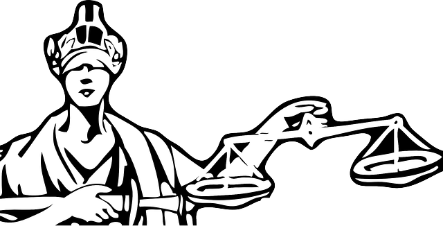

# Themis

Themis is a protocol that enables powerful proving, so identity
owners can know what they need to know about one another, trust that information,
but also respect one another's privacy. Its name refers to a titan in
Greek mythology who embodied judgment, impartiality, and fairness; she
is often shown blindfolded and holding scales, which resonates with the
anonymous, attribute-based credentials and the zero-knowledge proofs
at the heart of Themis technology.

Themis is a subset or subprotocol of the overarching protocol for self-sovereign
identity. It assumes the existence of certain ecosystem features such as
agents and keys, and is thus dependent on a larger context.

## Guiding Principles of this Protocol
### Distributed/Decentralized
### The Identity Owner is in control
TODO: They hold the claims. They don't have to go back to the issuer to tweak their claims to be able to prove things on their claims.

No coordination needed between Issuer and Relying Parties.

##### Selective Disclosure
###### True Selective Disclosure requires ZKP
There are levels of selective disclosure. An example of selective disclosure might be to share just my birthdate from my driver license when I need to prove I'm over the age of 18. My birthdate can be used with other information about me shared or inferred to strongly identify me. We can do better.

Better would be to share just my birth year, which would work for most people. If I turned 18 this year, then I'd have to fall back to showing birth month, and possibly birth day as well. But it's still better.

Better might be to ask the Issuer to include a field just for "over 18". Then I can prove I'm over 18 without sharing my birthdate or birth year. But what if I'm a smoker and I travel to a state in the US that has a 19 year-old smoking statute? What if I'm over 18 in the UK, and I travel to the US and want to prove I'm over 21 (US drinking age).

### Themis sub-protocols
The Sovrin Sub-protocols include:
1. Issuer Setup
1. Connecting
1. Issuing
1. Proving
1. Revoking

#### Issuer Setup
Issuers of Credentials need three basic Public Objects before they can issue Credentials:
1. A public DID and Document
1. Credential Definition
1. Revocation Registry

##### Public DID and DID Document
An Issuer is a well-known entity in the Sovrin ecosystem. They have a public DID that is referenced by their Credential Definitions and Revocation Registries.

##### Credential Definition
An Issuer issues Credentials against a Credential type, called a Credential Definition. A Credential Definition includes two major parts: (1) a reference to a Schema, and (2) public keys specific to the credentials issued under that Credential Definition.

The Schema is a template that defines the fields and data types and semantics of the credentials issued under that Credential Definitions. A Credential Definition can reference any public Schema created by any party. This allows for public reuse of well-designed Schema, which should drive consolidation and a form of standardization over time.

The public keys are used by Relying Parties to verify that a person really has a Credential from that Issuer. The issuer generates special private and public keys for a specific Credential Definition, securely storing the private keys, and publishing the public key in the Credential Definition on the ledger.

These terms are abstract, so an example may be helpful. The California State Driver License Division is an Issuer. They have a number of fields on their standard driver license. They create a Schema (if an existing one is not adequate) with those fields they use on their driver license today. They call this Schema "Bear Driver License" and give it version "0.1.0". They generate the keys and publish it in a Credential Definition they call "California Driver License" and give it version "1".

##### Revocation Registry
Holders of Credentials need the ability to prove the credential they have is valid without that Proof being linkable back to the Issuer or another Relying Party. The Revocation Registry is a mechanism that allows a Credential holder to prove in zero knowledge that the credential they hold has not been revoked.

During setup, an Issuer creates one or more Revocation Registries to support this ability with its Credential holders. The credentials hold a special serial number that allows the holder to prove theirs is not revoked.

Issuers can issue and revoke credentials in the Revocation Registry in a way that doesn't disclose which credential was revoked. If an issuer does not add the credential to the Registry, or revokes a credential, the next time a Credential holder tries to prove their credential is not revoked, they will be unable to do so.

##### Pre-issuing the Revocation Registry
A credential needs to have its serial number in the Registry in order for its holder to prove it has not been revoked. Because Issuance and Revocation are done with a public Registry, there are some timing attacks that are possible if a Relying Party knows exactly when a Credential is issued. To guard against this, we recommend Issues pre-issue their revocation registry. This means every Credential they issue will already be part of the Registry, and only revocations need to be written to the public Registry.

This has a side benefit of reducing the number writes to the public ledger, which also removes the chance of race conditions from using a credential too quickly after issuance. Of course more advanced schemes could be employed to limit timing attacks, but pre-issuance appears to be a simple solution.

#### Connecting Sub-Protocol
TODO

#### Issuing Sub-Protocol
The Issuing sub-protocol describes the interaction between the Issuer and Identity Owner. This interaction follows the Negotiation Pattern. Here is the mapping to the pattern:
* The **Identity Owner** assumes the *Acquirer* role in the pattern. 
* The **Issuer** assumes the *Producer* role.
* The **Credential Offer** maps to the *Offer*.
* The **Credential Request** maps to the *Request*.
* The **Credential** maps to the *Matter* in the pattern.

If an Issuer is pre-issuing its Revocation Registry (recommended), then no ledger write is required for Issuance. Otherwise, a single transaction to update the Revocation Registry is required before the Credential can be used.

Updates to a Revocation Registry can be batched. If an Issuer issues and revokes a large number of Credentials in a short period of time, these issuances and revocations can be combined in one efficient transaction.

#### Proving Sub-Protocol
The Proving sub-protocol describes the interaction between the Relying Party and Identity Owner. This interaction also follows the Negotiation Pattern with one caveat: there would not be a leading Proof Offer. The Authentication Sub-Protocol would start with a Proof Request. If a Credential holder could not or wished not to provide Proof as requested by the Proof Request, then the credential holder could send a Proof Offer that described the proof it was willing to share. The Authentication sub-protocol lists guidelines that the Relying Party could follow while constructing the Proof Request such that the Identity Owner can ensure that requested information respects its privacy. 

Here is the mapping to the pattern:
* The **Relying Party** assumes the *Acquirer* role in the pattern.
* The **Identity Owner** assumes the *Producer* role.
* The **Proof Offer** maps to the *Offer*.
* The **Proof Request** maps to the *Request*.
* The **Proof** maps to the *Matter* in the pattern.

#### Revoking Sub-Protocol
Revocations are accomplished with a Ledger write to the Revocation Registry. The Issuer should also communicate with the Credential holder directly that their Credential was revoked using a CRED_NOTICE message.
